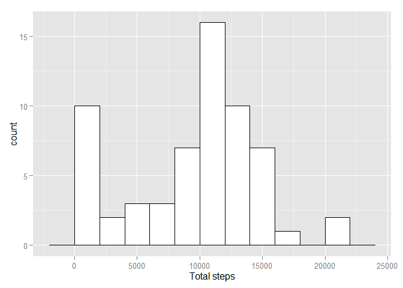
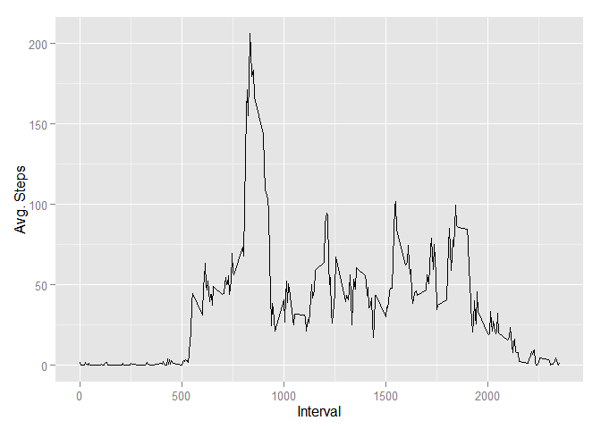
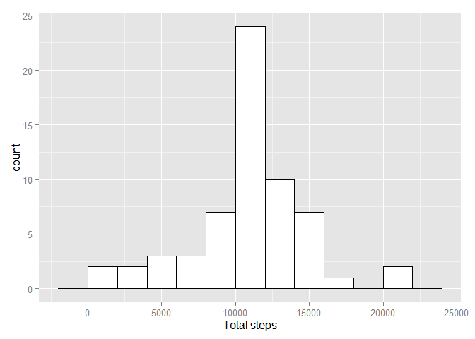
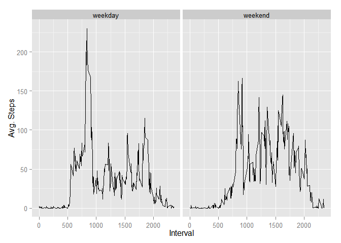

# Reproducible Research: Peer Assessment 1

# Introduction

It is now possible to collect a large amount of data about personal movement using activity monitoring devices such as a Fitbit, Nike Fuelband, or Jawbone Up. These type of devices are part of the "quantified self" movement - a group of enthusiasts who take measurements about themselves regularly to improve their health, to find patterns in their behavior, or because they are tech geeks. But these data remain under-utilized both because the raw data are hard to obtain and there is a lack of statistical methods and software for processing and interpreting the data.

This assignment makes use of data from a personal activity monitoring device. This device collects data at 5 minute intervals through out the day. The data consists of two months of data from an anonymous individual collected during the months of October and November, 2012 and include the number of steps taken in 5 minute intervals each day.


## Loading and preprocessing the data


```r
options(scipen = 100, digits = 4)
set.seed(123)
data <- read.csv("activity.csv")
library(dplyr)
library(ggplot2)
library(Amelia)
data$date <- as.Date(data$date, "%Y-%m-%d")
data_by_date <- group_by(data, date)
data_by_interval <- data %>% group_by(interval) %>% summarise(mean_steps=mean(steps, na.rm=T))
data_summary <- summarise(data_by_date, total_steps=sum(steps, na.rm=T))
```

## What is mean total number of steps taken per day?

```r
## The number of steps taken per day, the mean of steps per day and the median is displayed below
data_summary
```

```
## Source: local data frame [61 x 2]
## 
##          date total_steps
## 1  2012-10-01           0
## 2  2012-10-02         126
## 3  2012-10-03       11352
## 4  2012-10-04       12116
## 5  2012-10-05       13294
## 6  2012-10-06       15420
## 7  2012-10-07       11015
## 8  2012-10-08           0
## 9  2012-10-09       12811
## 10 2012-10-10        9900
## 11 2012-10-11       10304
## 12 2012-10-12       17382
## 13 2012-10-13       12426
## 14 2012-10-14       15098
## 15 2012-10-15       10139
## 16 2012-10-16       15084
## 17 2012-10-17       13452
## 18 2012-10-18       10056
## 19 2012-10-19       11829
## 20 2012-10-20       10395
## 21 2012-10-21        8821
## 22 2012-10-22       13460
## 23 2012-10-23        8918
## 24 2012-10-24        8355
## 25 2012-10-25        2492
## 26 2012-10-26        6778
## 27 2012-10-27       10119
## 28 2012-10-28       11458
## 29 2012-10-29        5018
## 30 2012-10-30        9819
## 31 2012-10-31       15414
## 32 2012-11-01           0
## 33 2012-11-02       10600
## 34 2012-11-03       10571
## 35 2012-11-04           0
## 36 2012-11-05       10439
## 37 2012-11-06        8334
## 38 2012-11-07       12883
## 39 2012-11-08        3219
## 40 2012-11-09           0
## 41 2012-11-10           0
## 42 2012-11-11       12608
## 43 2012-11-12       10765
## 44 2012-11-13        7336
## 45 2012-11-14           0
## 46 2012-11-15          41
## 47 2012-11-16        5441
## 48 2012-11-17       14339
## 49 2012-11-18       15110
## 50 2012-11-19        8841
## 51 2012-11-20        4472
## 52 2012-11-21       12787
## 53 2012-11-22       20427
## 54 2012-11-23       21194
## 55 2012-11-24       14478
## 56 2012-11-25       11834
## 57 2012-11-26       11162
## 58 2012-11-27       13646
## 59 2012-11-28       10183
## 60 2012-11-29        7047
## 61 2012-11-30           0
```

```r
mean_total_steps <- mean(data_summary$total_steps)
median_total_steps <- median(data_summary$total_steps)
ggplot(data_summary, aes(x=total_steps)) + geom_histogram(binwidth=2000,colour="black", fill="white") + xlab("Total steps")
```

 

The mean of total steps per day is 9354.2295 and the median is 10395.


## What is the average daily activity pattern?

```r
ggplot(data_by_interval, aes(interval, mean_steps)) + geom_line() + xlab("Interval") + ylab("Avg. Steps")
```

 

The maximum average number of steps is 206.1698 as calculated below:


```r
data_by_interval[which.max(data_by_interval$mean_steps),]
```

```
## Source: local data frame [1 x 2]
## 
##   interval mean_steps
## 1      835      206.2
```


## Imputing missing values

```r
# The number of missing values
sum(!complete.cases(data))
```

```
## [1] 2304
```

```r
# Create new data set and fill in missing values 
# In this case, we're filling in with the 5-second average previosly calculated
data_imputer <- sapply(data[!complete.cases(data),]$interval, function(x) { return(filter(data_by_interval, interval==x)["mean_steps"]) })
new_data <- data
new_data[!complete.cases(data),]$steps <- unlist(data_imputer)

new_data_by_date <- group_by(new_data, date)
new_data_summary <- summarise(new_data_by_date, total_steps=sum(steps, na.rm=T))

## The number of steps taken per day, the mean of steps per day and the median is displayed below
new_data_summary
```

```
## Source: local data frame [61 x 2]
## 
##          date total_steps
## 1  2012-10-01       10766
## 2  2012-10-02         126
## 3  2012-10-03       11352
## 4  2012-10-04       12116
## 5  2012-10-05       13294
## 6  2012-10-06       15420
## 7  2012-10-07       11015
## 8  2012-10-08       10766
## 9  2012-10-09       12811
## 10 2012-10-10        9900
## 11 2012-10-11       10304
## 12 2012-10-12       17382
## 13 2012-10-13       12426
## 14 2012-10-14       15098
## 15 2012-10-15       10139
## 16 2012-10-16       15084
## 17 2012-10-17       13452
## 18 2012-10-18       10056
## 19 2012-10-19       11829
## 20 2012-10-20       10395
## 21 2012-10-21        8821
## 22 2012-10-22       13460
## 23 2012-10-23        8918
## 24 2012-10-24        8355
## 25 2012-10-25        2492
## 26 2012-10-26        6778
## 27 2012-10-27       10119
## 28 2012-10-28       11458
## 29 2012-10-29        5018
## 30 2012-10-30        9819
## 31 2012-10-31       15414
## 32 2012-11-01       10766
## 33 2012-11-02       10600
## 34 2012-11-03       10571
## 35 2012-11-04       10766
## 36 2012-11-05       10439
## 37 2012-11-06        8334
## 38 2012-11-07       12883
## 39 2012-11-08        3219
## 40 2012-11-09       10766
## 41 2012-11-10       10766
## 42 2012-11-11       12608
## 43 2012-11-12       10765
## 44 2012-11-13        7336
## 45 2012-11-14       10766
## 46 2012-11-15          41
## 47 2012-11-16        5441
## 48 2012-11-17       14339
## 49 2012-11-18       15110
## 50 2012-11-19        8841
## 51 2012-11-20        4472
## 52 2012-11-21       12787
## 53 2012-11-22       20427
## 54 2012-11-23       21194
## 55 2012-11-24       14478
## 56 2012-11-25       11834
## 57 2012-11-26       11162
## 58 2012-11-27       13646
## 59 2012-11-28       10183
## 60 2012-11-29        7047
## 61 2012-11-30       10766
```

```r
new_mean_total_steps <- mean(new_data_summary$total_steps)
new_median_total_steps <- median(new_data_summary$total_steps)
ggplot(new_data_summary, aes(x=total_steps)) + geom_histogram(binwidth=2000,colour="black", fill="white") + xlab("Total steps")
```

 

The new mean of total steps per day is 10766.189 and the new median is 10766.189.  
Conclusion: the numbers differ. For instance, the mean without filling in the missing data is about 15% lower than the new mean. Besides this, the median without filling in the missing data is about 3% lower than the new median.


## Are there differences in activity patterns between weekdays and weekends?

```r
## Create new column weekday, False is weekend, True is weekday
new_data <- mutate(new_data, weekday=ifelse(as.integer(strftime(new_data$date, format="%w"))%%6!=0,"weekday", "weekend"))
new_data$weekday <- factor(new_data$weekday)

new_data_week <- new_data %>% group_by(interval, weekday) %>% summarise(mean_steps=mean(steps))

ggplot(new_data_week, aes(interval, mean_steps)) + facet_wrap(~weekday) + geom_line() + xlab("Interval") + ylab("Avg. Steps")
```

 
